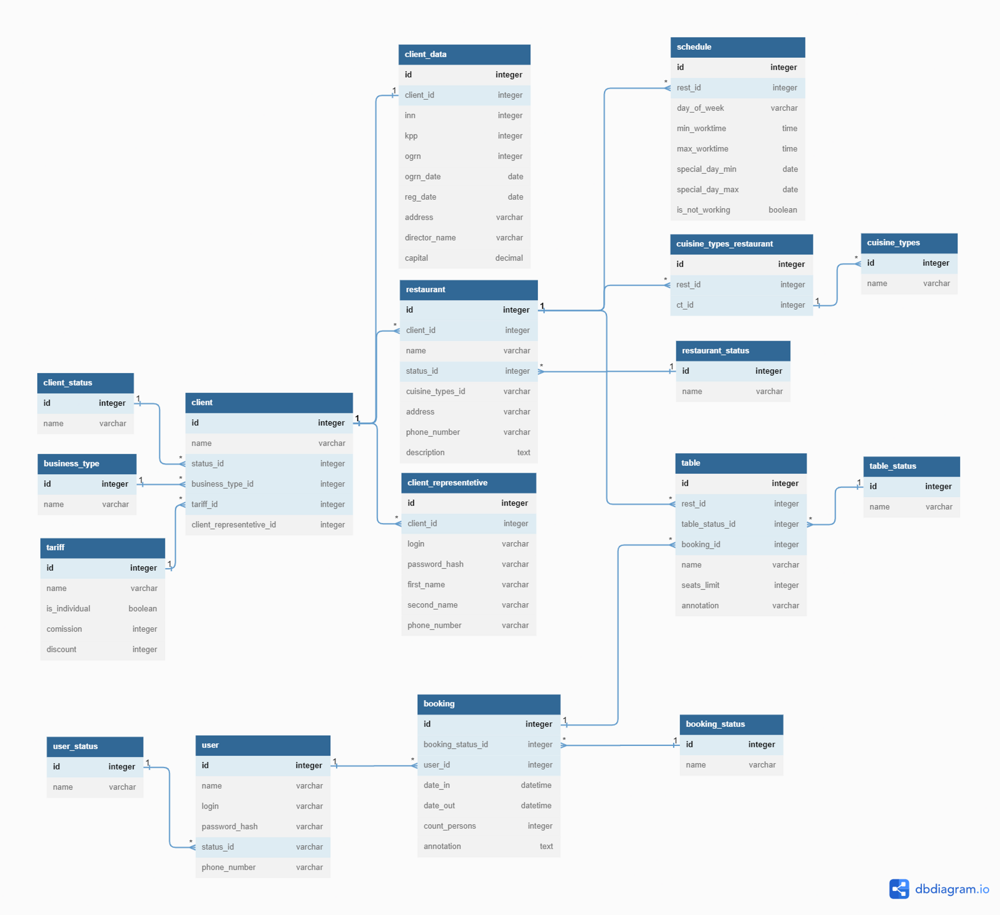

# Информационная модель

## Модель предметной области

В рамках MVP проекта были выделены основные сущности с атрибутами и определены связи между ними.

Базовыми сущностями являются:

- Тариф
- Клиент
- Ресторан
- Пользователь

## Модель данных

