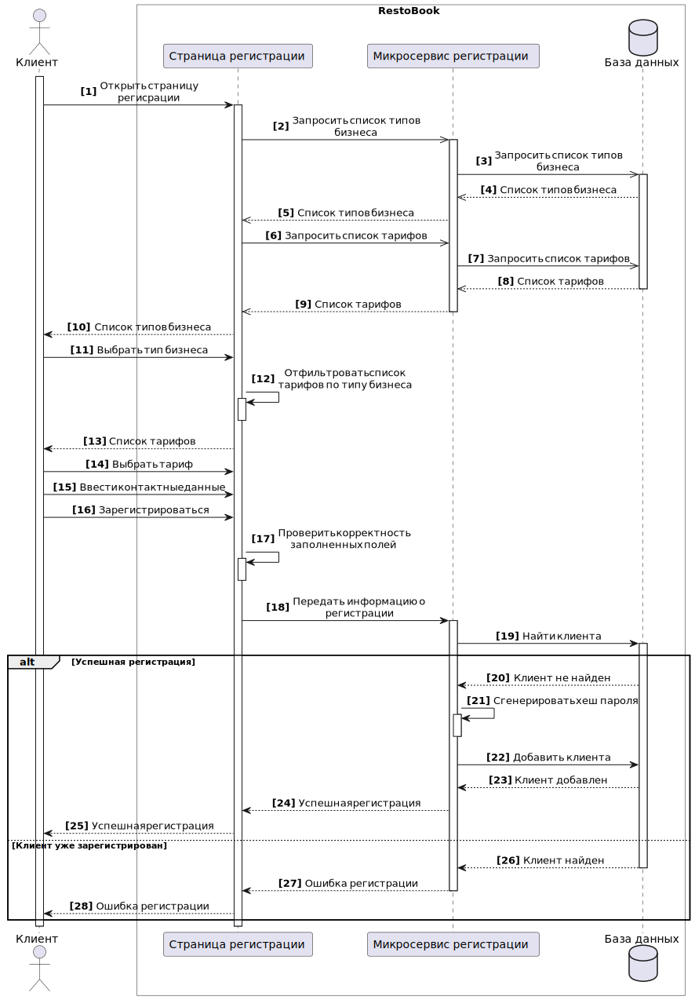
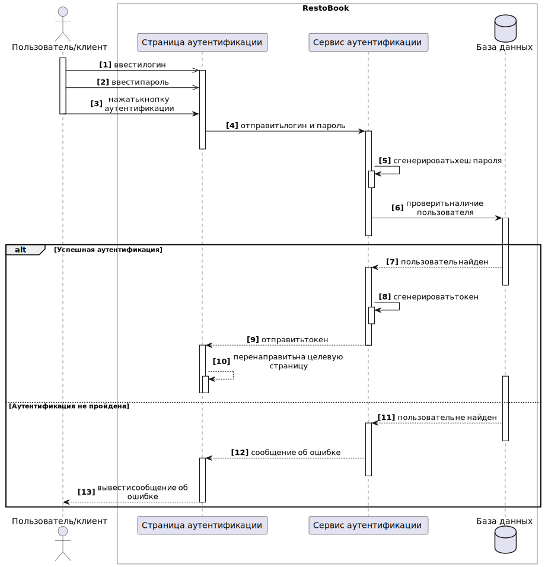
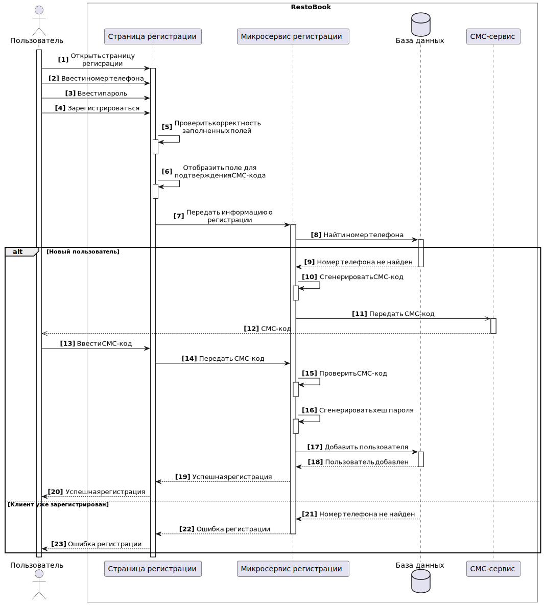

# Требования к системе

## Требования к системе в целом

### Производительность

**`NFPER1`** Система должна обслуживать нем менее 1000 пользователей в период пиковой активности с 13:00 до 20:00 по местному времени, со средней продолжительностью сеанса 8 минут.  

**`NFPER2`** Все веб-страницы, генерируемые системой, должны полностью загружаться не более чем за 4 секунды после запроса их по интернет-подключению со скоростью 20 Мбит/сек.  

**`NFPER3`** Система должна выводить пользователю сообщение о подтверждении в среднем за 3 секунды и не более чем через 6 секунд после того, как пользователь отослал информацию системе.  

### Безопасность

**`NFSEC1`** Система должна предусматривать аутентификацию пользователей в системе по номеру телефона и паролю.  

**`NFSEC2`** Пользователи должны обязательно аутентифицироваться для выполнения для бронирования столика.  

**`NFSEC3`** Система должна позволять пользователям просматривать только бронирования, размещенные ими лично, но не другими пользователями.

### Масштабируемость

**`NFEXT1`** Сервис должен поддерживать ежегодный рост клиентов на 10% без потери текущей производительности.

### Надежность

**`NFROB1`** Вероятность возникновения критической ошибки должна составлять не более 10% в течение месяца.  

**`NFROB2`** Если соединение между пользователем и системой разрывается до того, как заказ подтвержден или отменен, система должна позволять пользователю восстановить незавершенный заказ и продолжить работу.

### Совместимость

**`NFCOM1`** Мобильное приложение должно быть совместимо с ОС Android 5.0 или выше и iOS 10 или выше. 

**`NFCOM2`** Веб-приложение должно быть соместимо с браузерами, работающими на движках: Blink; Gecko; WebKit.

**`NFCOM3`** Интеграция между системой и рестораном должна осуществляться через R-Keeper.  

**`NFCOM4`** Аналитика в приложении должна производиться с помощью сервиса Яндекс Аналитика.  

### Доступность

**`NFAVL1`** Система должна быть доступна 98% времени между 5:00 и полуночью по местному времени и 90% времени между полуночью и 5:00 по местному времени, за исключением времени планового обслуживания.  

**`NFAVL2`** Допустимое время простоя в сутки не более 30 минут.

### Особенности хранения данных

**`NFDT1`** Данные о сроках заказа должны храниться 30 дней с момента получения заказа клиентом.  

**`NFDT2`** История бронирований пользователей должна храниться 2 года.  

**`NFDT3`** Бекапы БД должны производиться каждые 60 мин.  

**`NFDT4`** Бекапы БД должны храниться 7 дней с момента создания.

### Концептуальная целостность

**`NFARC1`** Система должна соответствовать архитектурному стилю REST.  

### Поддерживаемость

**`NFSUP1`** Необходимо логировать действия пользователей в системе. Просмотр данных логов должен осуществляться через графический интерфейс. 

**`NFSUP2`** Система должна обеспечивать мониторинг производительности с использованием графического интерфейса.

## Требования к функциям (задачам), выполняемым системой

### UseCase диаграмма

Основные функции системы представлены в виде UseCase диаграммы.  

### Описание UseCase, реализуемых в рамках MVP

#### Регистрация клиента

| Название                                            | UC-1: Регистрация клиента                                                                                                                                                                                                                                                                                                                                                                                                                                                                                                                                                                                                                                                                                                                                                                                                                                                                                                                    |
|-----------------------------------------------------|----------------------------------------------------------------------------------------------------------------------------------------------------------------------------------------------------------------------------------------------------------------------------------------------------------------------------------------------------------------------------------------------------------------------------------------------------------------------------------------------------------------------------------------------------------------------------------------------------------------------------------------------------------------------------------------------------------------------------------------------------------------------------------------------------------------------------------------------------------------------------------------------------------------------------------------------|
| Краткое описание                                    | Регистрация клиента в приложении для последующего размещения услуг бронирования.                                                                                                                                                                                                                                                                                                                                                                                                                                                                                                                                                                                                                                                                                                                                                                                                                                                             |
| Субъекты                                            | 1. Пользователь - клиент или менеджер 2. Система                                                                                                                                                                                                                                                                                                                                                                                                                                                                                                                                                                                                                                                                                                                                                                                                                                                                                         |
| Предусловие                                         | Пользователь зашел на страницу регистрации                                                                                                                                                                                                                                                                                                                                                                                                                                                                                                                                                                                                                                                                                                                                                                                                                                                                                                   |
| Основной сценарий                                   | 1. Пользователь переходит на страницу регистрации клиентов.  2. Система выводит список типов бизнеса.  3. Пользователь выбирает тип бизнеса из предложенного списка и нажимает кнопку - N1.  4. Система выводит список стандартных тарифов.  5. Пользователь выбирает стандартный тариф или N2 и нажимает кнопку - N1.  6. Система выводит форму ввода контактных данных.  7. Пользователь заполняет форму и нажимает кнопку - N1.  8. Система проверяет корректность заполненной информации.  9. Система выводит всю введенную пользователем информацию для проверки. На странице отображаются кнопки N3 и N4.      1. Если введенная пользователем информация некорректная - AF1.  10. Пользователь нажимает кнопку - N3. Конец сценария.      1. Если пользователь вышел из приложения и не нажал кнопку N3 - AF2.      2. Если пользователь захотел изменить введенную информацию - AF3. |
| Альтернативный сценарий                             | AF1: Информация заполнена некорректно.  1. Система выводит всю введенную пользователем информацию. Некорректно заполненная информация выделяется цветом. Кнопка N3 недоступна для нажатия.  2. Пользователь нажимает кнопку N4 и корректирует информацию.  3. Переход к п.8 основного сценария.  AF2: Регистрация не подтверждена.      1. Система сохраняет введенные пользователем данные.      2. Система отправляет сообщение оператору о незавершенной регистрации ЮЛ. Конец сценария.  AF3:  Изменение введенной информации.  1. Пользователь нажимает кнопку N4 и корректирует информацию.  2. Переход к п.8 основного сценария.                                                                                                                                                                                                                                                                  |
| Наименования элементов пользовательского интерфейса | N1: “Далее”  N2: “Подобрать индивидуальный тариф”  N3: “Подтвердить регистрацию”  N4: “Изменить информацию”                                                                                                                                                                                                                                                                                                                                                                                                                                                                                                                                                                                                                                                                                                                                                                                                                      |
| Диаграмма                                           | { width="100" }                                                                                                                                                                                                                                                                                                                                                                                                                                                                                                                                                                                                                                                                                                                                                                                                                                                                                  |

#### Аутентификация клиента

| Название                                            | UC-3: Аутентификация клиента                                                                                                                                                                                                                                                                                                                                                                                                                                                                     |
|-----------------------------------------------------|--------------------------------------------------------------------------------------------------------------------------------------------------------------------------------------------------------------------------------------------------------------------------------------------------------------------------------------------------------------------------------------------------------------------------------------------------------------------------------------------------|
| Краткое описание                                    | Вход в ЛК клиента                                                                                                                                                                                                                                                                                                                                                                                                                                                                                |
| Субъекты                                            | 1. Клиент 2. Система                                                                                                                                                                                                                                                                                                                                                                                                                                                                         |
| Предусловие                                         | Клиент зарегистрирован в системе                                                                                                                                                                                                                                                                                                                                                                                                                                                                 |
| Основной сценарий                                   | 1. Клиент открыл страницу аутентификации. 2. Клиент вводит логин. 3. Клиент вводит пароль. 4. Клиент нажимает кнопку N1.     1. Если лоин или пароль введены некорректно - AF-1 5. Аутентификация пройдена. Система открывает странцу ЛК. Конец сценария.                                                                                                                                                                                                                    |
| Альтернативный сценарий                             | AF1: Информация заполнена некорректно.  1. Система выводит на странице сообщение N2 и кнопка N3.     1. Если клиент нажал N3 - AF-2. 2. Переход к п.2 основного сценария. Конец сценария. AF-2: Восстановление пароля. 1. Система выводит диалоговое окно для ввода имейла, указанного при регистрации. 2. Клиент вводит имейл и нажимает кнопку N4. 3. Система отправляет новый пароль на введенный имейл. 4. Переход к п.2 основного сценария. Конец сценария. |
| Наименования элементов пользовательского интерфейса | N1: "Войти" N2: "Логин или пароль введен неверно." N3: “Восстановить пароль”  N4: “Отправить”                                                                                                                                                                                                                                                                                                                                                                                        |
| Диаграмма                                           | { width="100" }                                                                                                                                                                                                                                                                                                                                                                                                                                                     |

#### Активация ЛК клиента

| Название                                            | UC-4: Активация ЛК клиента                                                                                                                                                                                                                                   |
| --------------------------------------------------- | ------------------------------------------------------------------------------------------------------------------------------------------------------------------------------------------------------------------------------------------------------------ |
| Краткое описание                                    | Активация ЛК для расширения функциональности УЗ клиента                                                                                                                                                                                                      |
| Субъекты                                            | 1\. Клиент 2\. Система                                                                                                                                                                                                                                    |
| Предусловие                                         | Клиент вошел в ЛК                                                                                                                                                                                                                                            |
| Основной сценарий                                   | 1\. Клиент нажимает кнопку N1. 2\. Система отправляет на указанный при регистрации имейл ссылку для активации ЛК. 3\. Клиент переходитоткрывает ссылку в сообщении из п.2 4\. Система открывает страницу ЛК и выводит сообщение N2. Конец сценария. |
| Наименования элементов пользовательского интерфейса | N1: "Отправить на email ссылку для активации" N2: "Учетная запись успешно активирована"                                                                                                                                                                   |

#### Просмотр информации о своей организации

| Название                                            | UC-5: Просмотр информации о своей организации                                                                               |
| --------------------------------------------------- | --------------------------------------------------------------------------------------------------------------------------- |
| Краткое описание                                    | Просмотр информации о компании-владельце ресторана                                                                          |
| Субъекты                                            | 1\. Клиент 2\. Система                                                                                                   |
| Предусловие                                         | Клиент вошел в ЛК                                                                                                           |
| Основной сценарий                                   | 1\. На странице ЛК клиент нажимает кнопку N1 2\. Система открывает страницу с информацией об организации. Конец сценария |
| Наименования элементов пользовательского интерфейса | N1: "Просмотр данных об организации"                                                                                        |

#### Добавление информации о ресторане

| Название                                            | UC-7: Добавление информации о ресторане                                                                                                                                                                                                                                                                                                                                                     |
| --------------------------------------------------- | ------------------------------------------------------------------------------------------------------------------------------------------------------------------------------------------------------------------------------------------------------------------------------------------------------------------------------------------------------------------------------------------- |
| Краткое описание                                    | Добавление ресторана и информации о ресторане                                                                                                                                                                                                                                                                                                                                               |
| Субъекты                                            | 1\. Клиент 2\. Система                                                                                                                                                                                                                                                                                                                                                                   |
| Предусловие                                         | Клиент вошел в ЛК                                                                                                                                                                                                                                                                                                                                                                           |
| Основной сценарий                                   | 1\. Клиент нажимает кнопку N1. 2\. Система открывает страницу добавления нового ресторана. 3\. Клиент заполняет необходимые поля данными о ресторане. 4\. Клиент добавляет описание столиков - UC-9 5\. Клиент нажимает кнопку N2.     1. Если клиент оставил обязательные для заполнения поля пустыми - AF-1. 6\. Система сохраняет введеную информацию. Конец сценария. |
| Альтарнативный сценарий                             | AF-1: Обязательные к заполнению поля не заполнены 1\. Система выделяет красным цветом поля, которые остались пустыми, но обязательны к заполнению. 2\. Клиент заполняет пустые поля. 3\. Переход к п.5 основного сценария. Конец сценария.                                                                                                                                         |
| Наименования элементов пользовательского интерфейса | N1: "Добавить ресторан" N2: "Сохранить"                                                                                                                                                                                                                                                                                                                                                  |

#### Добавление информации о столиках

| Название                                            | UC-9: Добавление информации о столиках                                                                                                                                                                                                                                                                                                                                                                                                                                             |
| --------------------------------------------------- | ---------------------------------------------------------------------------------------------------------------------------------------------------------------------------------------------------------------------------------------------------------------------------------------------------------------------------------------------------------------------------------------------------------------------------------------------------------------------------------- |
| Краткое описание                                    | Добавление столиков и их описания для ресторана                                                                                                                                                                                                                                                                                                                                                                                                                                    |
| Субъекты                                            | 1\. Клиент 2\. Система                                                                                                                                                                                                                                                                                                                                                                                                                                                          |
| Предусловие                                         | Клиент перешел на страницу создания ресторана или страницу просмотра данных о ресторане                                                                                                                                                                                                                                                                                                                                                                                            |
| Основной сценарий                                   | 1\. Клиент нажимает кнопку N1. 2\. Система открывает страницу добавления столиков. 3\. Клиент нажимает кнопку N2. 4\. Система выводит поля для заполнения для одного столика. 5\. Клиент заполняет необходимые поля 6\. Клиент нажимает кнопку N3.     1. Если клиент оставил обязательные для заполнения поля пустыми - AF-1. 7\. Система сохраняет введеную информацию. 8\. Клиент повторяет п.3 - п.5 для каждого создаваемого столика. Конец сценария. |
| Альтарнативный сценарий                             | AF-1: Обязательные к заполнению поля не заполнены 1\. Система выделяет красным цветом поля, которые остались пустыми, но обязательны к заполнению. 2\. Клиент заполняет пустые поля. 3\. Переход к п.6 основного сценария. Конец сценария.                                                                                                                                                                                                                                |
| Наименования элементов пользовательского интерфейса | N1: "Добавить столики" N2: "Добавить столик" N3: "Сохранить"                                                                                                                                                                                                                                                                                                                                                                                                                 |

#### Регистрация пользователя

| Название                                            | UC-12: Регистрация пользователя                                                                                                                                                                                                                                                                                                                                                                                                                                                                                                                                                                                                     |
|-----------------------------------------------------|-------------------------------------------------------------------------------------------------------------------------------------------------------------------------------------------------------------------------------------------------------------------------------------------------------------------------------------------------------------------------------------------------------------------------------------------------------------------------------------------------------------------------------------------------------------------------------------------------------------------------------------|
| Краткое описание                                    | Регистрация пользователя в приложении для возможности бронирования столиков.                                                                                                                                                                                                                                                                                                                                                                                                                                                                                                                                                        |
| Субъекты                                            | 1. Пользователь 2. Система                                                                                                                                                                                                                                                                                                                                                                                                                                                                                                                                                                                                      |
| Предусловие                                         | Пользователь зашел на страницу регистрации                                                                                                                                                                                                                                                                                                                                                                                                                                                                                                                                                                                          |
| Основной сценарий                                   | 1. Пользователь заполняет на странице данные для регистрации: имя пользователя, пароль, номер телефона.  2. Пользователь нажимает кнопку - N1.  3. Система проверяет наличие в системе пользователей с такими же номером телефона.     1. Если пользователь с введенным номером телефона уже существует - AF-1 4. Система отправляет СМС с кодом подтверждения на введенный номер телефона. 5. Система выводит диалоговое окно подтверждения номера телефона. 5. Пользователь вводит код подтверждения в диалоговом окне и нажимает кнопку N2. 6. Система сохраняет данные регистрации. Конец сценария. |
| Альтернативный сценарий                             | AF1: Пользователь с введенным номером телефона уже существует. 1. Система выводит сообщение, что введенный номер телефона уже зарегистрирован. 2. Пользователь нажимает кнопку N3. 3. Пользователь вводит новый номер телефона. 4. Переход к п.3 основного сценария. Конец сценария.                                                                                                                                                                                                                                                                                                                                |
| Наименования элементов пользовательского интерфейса | N1: “Зарегистрироваться”  N2: “Подтвердить”  N3: “Ок”                                                                                                                                                                                                                                                                                                                                                                                                                                                                                                                                                                       |
| Диаграмма                                           | { width="100" }                                                                                                                                                                                                                                                                                                                                                                                                                                                                                                                                                                           |

#### Аутентификация пользователя  

| Название                                            | UC-14: Аутентификация пользователя                                                                                                                                                                                                                                                                                       |
|-----------------------------------------------------|--------------------------------------------------------------------------------------------------------------------------------------------------------------------------------------------------------------------------------------------------------------------------------------------------------------------------|
| Краткое описание                                    | Вход в ЛК пользователя                                                                                                                                                                                                                                                                                                   |
| Субъекты                                            | 1. Пользователь 2. Система                                                                                                                                                                                                                                                                                           |
| Предусловие                                         | Пользователь зарегистрирован в системе                                                                                                                                                                                                                                                                                   |
| Основной сценарий                                   | 1. Пользователь открыл страницу аутентификации. 2. Пользователь вводит номер телефона. 3. Пользователь вводит пароль. 4. Пользователь нажимает кнопку N1.     1. Если номер телефона или пароль введены некорректно - AF-1 5. Аутентификация пройдена. Система открывает странцу ЛК. Конец сценария. |
| Альтернативный сценарий                             | AF1: Информация заполнена некорректно.  1. Система выводит на странице сообщение N2 и кнопка N3. 2. Переход к п.2 основного сценария. Конец сценария.                                                                                                                                                            |
| Наименования элементов пользовательского интерфейса | N1: "Войти" N2: "Логин или пароль введен неверно."                                                                                                                                                                                                                                                                   |
| Диаграмма                                           | { width="100" }                                                                                                                                                                                                                                                                             |

#### Выбор ресторана

| Название                                            | UC-15: Выбор ресторана                                                                                                                                                                                                                                                               |
| --------------------------------------------------- | ------------------------------------------------------------------------------------------------------------------------------------------------------------------------------------------------------------------------------------------------------------------------------------ |
| Краткое описание                                    | Выбор ресторана для просмотра описания и выбора столиков для бронирования.                                                                                                                                                                                                           |
| Субъекты                                            | 1\. Пользователь 2\. Система                                                                                                                                                                                                                                                      |
| Предусловие                                         | Пользователь открыл приложение                                                                                                                                                                                                                                                       |
| Основной сценарий                                   | 1\. Пользователь открыл страницу с каталогом ресторанов.     1. Если пользователь хочет найти ресторана через строку поиска - AF-1. 2\. Пользователь выбирает ресторан. 3\. Система открывает страницу с данными о выбранном ресторане. Конец сценария.                     |
| Альтернативный сценарий                             | AF1: Выбор ресторна через строку поиска. 1\. Пользователь вводит в строку поиска название ресторана или тип кухни. 2\. Пользователь нажимает N1. 3\. Система открывает страницу с результатами поискового запроса. 4\. Переход к п.2 основного сценария. Конец сценария. |
| Наименования элементов пользовательского интерфейса | N1: "Найти"                                                                                                                                                                                                                                                                          |

#### Бронирование столиков из списка

| Название                                            | UC-16: Бронирование столиков из списка.                                                                                                                                                                                                                                                                                                                                                                                                                                                                                                                                 |
|-----------------------------------------------------|-------------------------------------------------------------------------------------------------------------------------------------------------------------------------------------------------------------------------------------------------------------------------------------------------------------------------------------------------------------------------------------------------------------------------------------------------------------------------------------------------------------------------------------------------------------------------|
| Краткое описание                                    | Выбор и бронирование столиков из списка доступных столиков выбранного ресторана                                                                                                                                                                                                                                                                                                                                                                                                                                                                                         |
| Субъекты                                            | 1. Пользователь 2. Система                                                                                                                                                                                                                                                                                                                                                                                                                                                                                                                                          |
| Предусловие                                         | Пользователь выполнил UC-15                                                                                                                                                                                                                                                                                                                                                                                                                                                                                                                                             |
| Основной сценарий                                   | 1. Пользователь нажимает кнопку N1. 2. Система открвыает страницу со списком столиков. 3. Пользователь вводит дату и время начала и окончания бронирования. 4. Система оставляет в списке столиков только те столики, которые являются свободными в установленное пользователем время. 5. Пользователь выбирает столики. 6. Пользователь нажимает кнопку N2.  7. Система открывает диалоговое окно подтверждения бронирования. 8. Пользователь накимает N3. Конец сценария.     1. Если пользователь хочет изменить бронирование - AF1. |
| Альтернативный сценарий                             | AF1: Изменение параметров бронирования. 1. Пользователь нажимает кнопку N3. 2. Переход к п.3 основного сценария. Конец сценария.                                                                                                                                                                                                                                                                                                                                                                                                                                |
| Наименования элементов пользовательского интерфейса | N1: "Выбрать столики" N2: "Забронировать" N3: "Подтвердить" N4: "Отменить"                                                                                                                                                                                                                                                                                                                                                                                                                                                                                  |
| Диаграмма                                           | { width="100" }                                                                                                                                                                                                                                                                                                                                                                                                                                                                                                                   |

### Описание UseCase, реализуемых в рамках первого релиза

#### Отмена регистрации клиента

| Название                                            | UC-2: Отмена регистрации клиента                                                                                                                                                                                                                                                                                                                                 |
| --------------------------------------------------- | ---------------------------------------------------------------------------------------------------------------------------------------------------------------------------------------------------------------------------------------------------------------------------------------------------------------------------------------------------------------- |
| Краткое описание                                    | Прерывание регистрации клиента                                                                                                                                                                                                                                                                                                                                   |
| Субъекты                                            | 1\. Пользователь - клиент или менеджер 2\. Система                                                                                                                                                                                                                                                                                                            |
| Предусловие                                         | Пользователь выполняет сценарий UC-1                                                                                                                                                                                                                                                                                                                             |
| Основной сценарий                                   | 1\. Пользователь нажал кнопку N1. 2\. Система выводит диалоговое окно N2. В диалоговом окне отображены кнопки N3 и N4. 3\. Пользователь нажал кнопку N3 в диалоговом окне N2.     1. Если пользователь нажал кнопку N4 - AF-1. 4\. Система сохраняет введенные клиентом данные. 5\. Система выполняет переход на главную страницу. Конец сценария |
| Альтернативный сценарий                             | AF1: Информация заполнена некорректно. 1\. Система закрывает диалоговое окно N2. 2\. Пользователь продолжает выполнение сценария UC-1. Конец сценария.                                                                                                                                                                                                     |
| Наименования элементов пользовательского интерфейса | N1: "Прервать регистрацию" N2: "Вы уверены, что хотите прервать регистрацию?" N3: “Да” N4: “Нет”                                                                                                                                                                                                                                                        |

#### Изменение информации о своей организации

| Название                                            | UC-6: Изменение информации о своей организации                                                                                                                                                                                                                                                                                                                                                  |
| --------------------------------------------------- | ----------------------------------------------------------------------------------------------------------------------------------------------------------------------------------------------------------------------------------------------------------------------------------------------------------------------------------------------------------------------------------------------- |
| Краткое описание                                    | Изменение информации о компании-владельце ресторана                                                                                                                                                                                                                                                                                                                                             |
| Субъекты                                            | 1\. Клиент 2\. Система                                                                                                                                                                                                                                                                                                                                                                       |
| Предусловие                                         | Клиент выполнил сценарий UC-5                                                                                                                                                                                                                                                                                                                                                                   |
| Основной сценарий                                   | 1\. На странице просмотра информации об организации клиент нажимает кнопку N1. 2\. На странице из п.1 система делает инфорацию об организации доступной для редактирования. 3\. Клиент изменяет информацию. 4\. Клиент нажимает кнопку N2.     1. Если клиент оставил обязательные для заполнения поля пустыми - AF-1 5\. Система сохраняет введеную информацию. Конец сценария. |
| Альтарнативный сценарий                             | AF-1: Обязательные к заполнению поля не заполнены 1\. Система выделяет красным цветом поля, которые остались пустыми, но обязательны к заполнению. 2\. Клиент заполняет пустые поля. 3\. Переход к п.4 основного сценария. Конец сценария.                                                                                                                                             |
| Наименования элементов пользовательского интерфейса | N1: "Редактировать" N2: "Сохранить"                                                                                                                                                                                                                                                                                                                                                          |

#### Изменение информации о ресторане

| Название                                            | UC-8: Изменение информации о ресторане                                                                                                                                                                                                                                                                                                                                                       |
| --------------------------------------------------- | -------------------------------------------------------------------------------------------------------------------------------------------------------------------------------------------------------------------------------------------------------------------------------------------------------------------------------------------------------------------------------------------- |
| Краткое описание                                    | Изменение информации о добавленном ресторане                                                                                                                                                                                                                                                                                                                                                 |
| Субъекты                                            | 1\. Клиент 2\. Система                                                                                                                                                                                                                                                                                                                                                                    |
| Предусловие                                         | Клиент выполнил сценарий UC-7                                                                                                                                                                                                                                                                                                                                                                |
| Основной сценарий                                   | 1\. На странице просмотра информации о ресторане клиент нажимает кнопку N1. 2\. На странице из п.1 система делает инфорацию об организации доступной для редактирования. 3\. Клиент изменяет информацию. 4\. Клиент нажимает кнопку N2.     1. Если клиент оставил обязательные для заполнения поля пустыми - AF-1 5\. Система сохраняет введеную информацию. Конец сценария. |
| Альтарнативный сценарий                             | AF-1: Обязательные к заполнению поля не заполнены 1\. Система выделяет красным цветом поля, которые остались пустыми, но обязательны к заполнению. 2\. Клиент заполняет пустые поля. 3\. Переход к п.4 основного сценария. Конец сценария.                                                                                                                                          |
| Наименования элементов пользовательского интерфейса | N1: "Редактировать" N2: "Сохранить"                                                                                                                                                                                                                                                                                                                                                       |

#### Изменение информации о столиках

| Название                                            | UC-11: Изменение информации о столиках                                                                                                                                                                                                                                                                                                                                        |
| --------------------------------------------------- | ----------------------------------------------------------------------------------------------------------------------------------------------------------------------------------------------------------------------------------------------------------------------------------------------------------------------------------------------------------------------------- |
| Краткое описание                                    | Изменение информации о добавленных столиках                                                                                                                                                                                                                                                                                                                                   |
| Субъекты                                            | 1\. Клиент 2\. Система                                                                                                                                                                                                                                                                                                                                                     |
| Предусловие                                         | Клиент перешел на страницу просмотра данных о столиках                                                                                                                                                                                                                                                                                                                        |
| Основной сценарий                                   | 1\. На странице просмотра информации о столиках клиент нажимает кнопку N1. 2\. На странице из п.1 система делает информацию доступной для редактирования. 3\. Клиент изменяет информацию. 4\. Клиент нажимает кнопку N2.     1. Если клиент оставил обязательные для заполнения поля пустыми - AF-1 5\. Система сохраняет введеную информацию. Конец сценария. |
| Альтарнативный сценарий                             | AF-1: Обязательные к заполнению поля не заполнены 1\. Система выделяет красным цветом поля, которые остались пустыми, но обязательны к заполнению. 2\. Клиент заполняет пустые поля. 3\. Переход к п.4 основного сценария. Конец сценария.                                                                                                                           |
| Наименования элементов пользовательского интерфейса | N1: "Редактировать" N2: "Сохранить"                                                                                                                                                                                                                                                                                                                                        |

#### Просмотр бронирований

| Название                                            | UC-19: Просмотр бронирований                                                                                                                                                                                                                                                                                                                                                                                                                              |
| --------------------------------------------------- | --------------------------------------------------------------------------------------------------------------------------------------------------------------------------------------------------------------------------------------------------------------------------------------------------------------------------------------------------------------------------------------------------------------------------------------------------------- |
| Краткое описание                                    | Просмотр незавершенных бронирований и истории бронирований.                                                                                                                                                                                                                                                                                                                                                                                               |
| Субъекты                                            | 1\. Пользователь 2\. Система                                                                                                                                                                                                                                                                                                                                                                                                                           |
| Предусловие                                         | Пользователь вошел в ЛК                                                                                                                                                                                                                                                                                                                                                                                                                                   |
| Основной сценарий                                   | 1\. Пользователь нажимает кнопку N1. 2\. Система открвыает страницу просмотра бронирований.     Страница стостоит из двух вкладок:     N2. Вкладка откырвается по умолчанию при переходе на страницу. На вкладке выводятся бронирования, которые не были завершены.     N3. На вкладке отображаются бронирования, которые были звершены.     Конец сценария.     1. Если пользователю необходимо посмотреть историю бронирований - AF1. |
| Альтернативный сценарий                             | AF1: Просмотр истории бронирований. 1\. Пользователь переходит на вкладку N3. 2\. Система выводит список завершенных бронирований.                                                                                                                                                                                                                                                                                                                  |
| Наименования элементов пользовательского интерфейса | N1: "Посмотреть бронирования" N2: "Активные бронирования" N3: "История бронирований"                                                                                                                                                                                                                                                                                                                                                                |

#### Отмена бронирования

| Название                                            | UC-20: Отмена бронирования                                                                                                                                                                                                                                                                             |
| --------------------------------------------------- | ------------------------------------------------------------------------------------------------------------------------------------------------------------------------------------------------------------------------------------------------------------------------------------------------------ |
| Краткое описание                                    | Отмена активного бронирования.                                                                                                                                                                                                                                                                         |
| Субъекты                                            | 1\. Пользователь 2\. Система                                                                                                                                                                                                                                                                        |
| Предусловие                                         | Пользователь перешел на страницу просмотра бронирований                                                                                                                                                                                                                                                |
| Основной сценарий                                   | 1\. Пользователь выбирает бронирования, которые необходимо отменить. 2\. Система отображет кнопку N1. 3\. Пользователь нажимает кнопку N1. 4\. Система удаляет выбранные бронирования из списка активных бронирований. 5\. Система добавляет удаленные бронирования в исторю бронирований. |
| Наименования элементов пользовательского интерфейса | N1: "Удалить"                                                                                                                                                                                                                                                                                          |
