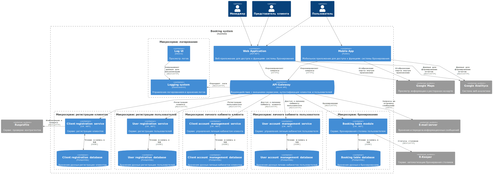

# file 1

## Отображение диаграмм plantuml



## Отображение Swagger спецификации

<swagger-ui src="https://petstore.swagger.io/v2/swagger.json"/>

## Buttons
[Subscribe to our newsletter](#){ .md-button }

## Code
``` py
import tensorflow as tf
```

## Table
| Method      | Description                          |
| ----------- | ------------------------------------ |
| `GET`       | :material-check:     Fetch resource  |
| `PUT`       | :material-check-all: Update resource |
| `DELETE`    | :material-close:     Delete resource |

| No. | Name   | Attribute |
| --  | --     | --        |
| 1.  | Apple  | Blah      |
| 1.  | Banana | Blah      |
| 1.  | Berry  | Blah      |


Создай спецификацию api swagger в формате yaml для приложения бронирования столиков в ресторанах:
Ресторан
1.	Рестораны с фильтром
2.	Ресторан по ид
3.	Добавить ресторан
4.	Изменить ресторан
5.	Просмтор списка столиков
6.	Добавить столики
7.	Изменить столики
Бронирование
1.	Посмотреть бронирования с фильтром история или свежие
2.	Просмотр деталей бронирования
3.	Бронирование столиков
4.	Отмена бронирования
5.	Повторить бронирование
Клиент
1.	Создать
2.	Редактировать данные
Пользователь
1.	Создать
2.	Редактировать данные
Объект ресторан обладает следующими атрибутами:
1.	Id ресторана
2.	Id клиента, которому принадлежит ресторан
3.	Название
4.	Адрес
5.	Логотип
6.	Описание
7.	Номер телефона
8.	Рейтинг
9.	Список столиков
Объект столик обладает следующими атрибутами:
1.	Id столика
2.	Название (номер столика)
3.	Статус (забронирован или не забронирован)
Объект клиент обладает следующими атрибутами:
1.	Имя компании
2.	Юридический адрес
3.	E-mail
Объект клиент обладает следующими атрибутами:
1.	Имя
2.	Номер телефона
