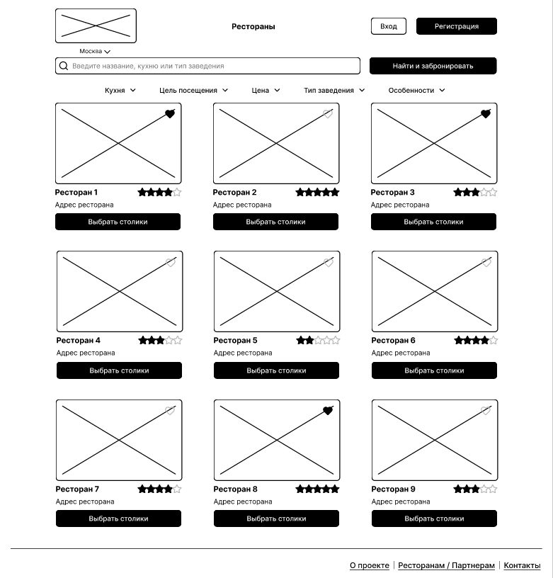
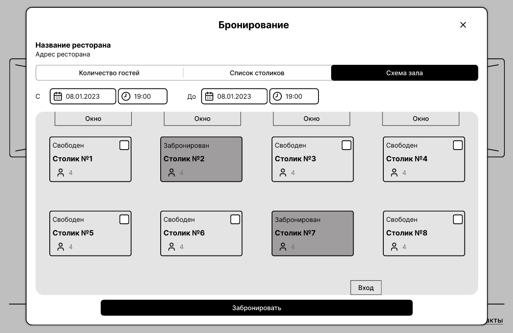
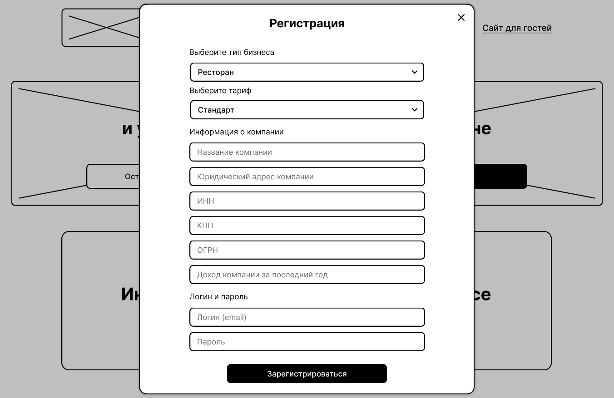

# Пользовательский интерфейс приложения

## Вайрфреймы

Пользовательский интерфейс представлен в виде вайрфоеймов страниц веб-приложения.

### **`WF1`** Главная страница

### **`WF2`** Каталог ресторанов

### **`WF3`** Форма аутентификации клиента и пользоватея

### **`WF4`** Форма регистрации пользователя

### **`WF5`** Личный кабинет пользователя

### Форма бронирования столиков

#### **`WF6`** По количеству гостей  

#### **`WF7`** Из списка  

#### **`WF8`** На схеме расположения  

### **`WF9`** Главная страница приложения для клиентов

### **`WF10`** Форма регистрации клиенета

### **`WF11`** Личный кабинет клиента

## Прототип приложения

Кликабельный прототип доступен по [ссылке](https://www.figma.com/proto/lRVhDoSioe3JRzBkb39OrH/%D0%A1%D0%B5%D1%80%D0%B2%D0%B8%D1%81-%D0%B4%D0%BB%D1%8F-%D0%B1%D1%80%D0%BE%D0%BD%D0%B8%D1%80%D0%BE%D0%B2%D0%B0%D0%BD%D0%B8%D1%8F?page-id=0%3A1&type=design&node-id=2-2&viewport=4%2C111%2C0.39&scaling=scale-down&starting-point-node-id=2%3A2)

